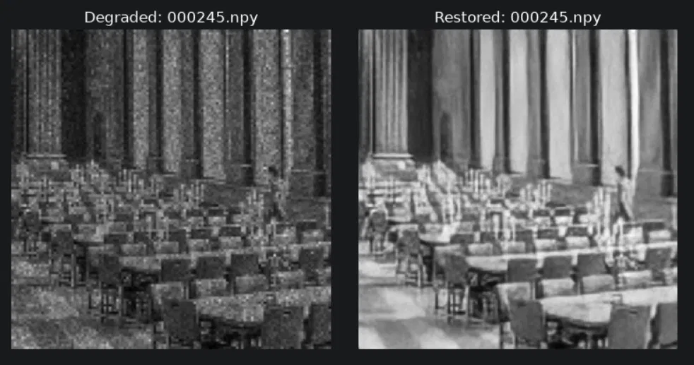
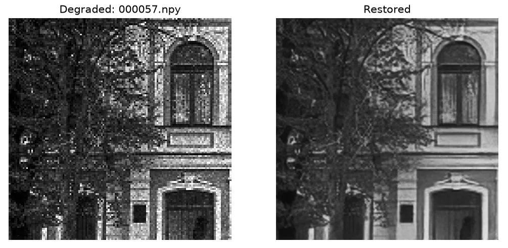
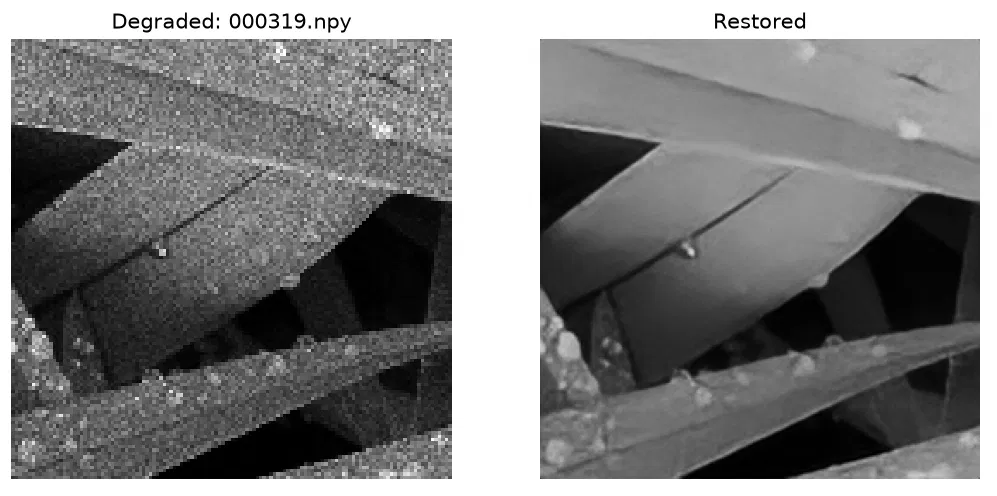

<div align="center">

<h1>LuciNoVera</h1>

<h3>AI-Based Restoration of Degraded Semiconductor Inspection Images</h3>

<p><em>KLA Problem Statement PS01 — Hackathon 2026, SEMICON India</em></p>

<p>


</p>

<p>
A single end-to-end neural network that removes speckle &amp; Gaussian noise<br>
and upscales resolution (128→256) for semiconductor inspection images — in one forward pass.
</p>

</div>

<br>

## Table of Contents

- [Overview](#overview)
- [Results](#results)
- [Repository Structure](#repository-structure)
- [Environment Setup](#environment-setup)
- [Dataset Format](#dataset-format-npy)
- [Running Inference](#running-inference--the-benchmarking-script)
- [Checking Real Quality Numbers](#checking-real-quality-numbers)
- [Reproducing Training](#reproducing-training)
- [Model Details](#model-details)
- [Loss Function Iteration](#what-we-tried--loss-function-iteration)
- [Known Limitation](#known-limitation)
- [Engineering Notes](#engineering-notes-challenges-faced)
- [Requirements & References](#requirements)

<br>

## Overview

Microscopic inspection images used in semiconductor manufacturing are often
degraded by **speckle noise**, **additive Gaussian noise**, and **reduced
spatial resolution**. This project restores all three in a single pass,
using a custom network built around three ideas:

|  |  |
|---|---|
| 🧱 **RRDB Backbone** | ESRGAN-style Residual-in-Residual Dense Blocks for stable, high-capacity detail reconstruction |
| 🔍 **Windowed Self-Attention** | Exploits the repetitive, periodic nature of semiconductor structures (e.g. transistor grids) |
| 🎛️ **Noise-Adaptive Conditioning** | A small side-branch estimates degradation severity per-image, adjusting the main trunk via FiLM |

The network also produces a **confidence/uncertainty map** alongside the
restored image — flagging regions that were heavily reconstructed, which
matters for defect-inspection safety.

<br>

## Results

<table align="center">
<tr><td align="center"><b>Columns & Chairs</b> — degraded (left) vs. restored (right)</td></tr>
<tr><td></td></tr>
<tr><td align="center"><b>Building Facade</b></td></tr>
<tr><td></td></tr>
<tr><td align="center"><b>Mechanical Structure</b></td></tr>
<tr><td></td></tr>
</table>

<div align="center">

| Metric | Value |
|:---:|:---:|
| **PSNR** ↑ | 25.02 dB |
| **SSIM** ↑ | 0.7122 |
| **LPIPS** ↓ | 0.2610 |
| **Inference** | ~29 ms/image (RTX 3050 laptop GPU) |

</div>

Measured on a held-out validation split (10% of training pairs, never seen
during training) using [`evaluate.py`](evaluate.py). KLA benchmarks on an
H100 GPU, which is substantially faster than the hardware used here.

More samples live in [`results/comparison_samples/`](results/comparison_samples/).
Generate your own random comparisons:
```bash
python compare_restored.py --n 5 --seed 42
```

<br>

## Repository Structure

<details>
<summary><b>Click to expand</b></summary>

```
repository/
├── README.md
├── requirements.txt
├── train.py                     # training script
├── inference.py                 # standalone inference script (input_dir/output_dir)
├── evaluate.py                  # real PSNR/SSIM/LPIPS + diagnostics on held-out split
├── verify_pairs.py              # sanity-check GT/degraded pairing
├── compare_restored.py          # view/save random restored-vs-degraded samples
├── rebuild_checkpoint.py        # rebuilds a resumable checkpoint from clean weights
├── check_nan.py                 # checks a checkpoint for NaN/Inf corruption
│
├── configs/
│   └── final_config.yaml        # final model config, training commands, results
│
├── src/
│   ├── model/
│   │   ├── blocks.py            # RRDB blocks, dense blocks, windowed attention
│   │   ├── noise_estimator.py   # noise-level estimation branch + FiLM conditioning
│   │   ├── restoration_net.py   # full network (small / medium / large configs)
│   │   └── losses.py            # Charbonnier, SSIM, Edge, FFT, Uncertainty,
│   │                             # Laplacian, VGG Perceptual, Gram-matrix Texture,
│   │                             # Brightness-consistency losses (combined, tunable)
│   ├── data/
│   │   ├── npy_dataset.py       # .npy loader, shape/dtype handling, normalization
│   │   └── degrade.py           # synthetic degradation augmentation
│   └── utils/
│       ├── metrics.py           # PSNR / SSIM / LPIPS
│       └── tta.py               # test-time self-ensembling
│
├── weights/
│   └── restoration_model_final.pt
├── checkpoints/                 # training runs land here
└── results/
    ├── test_restored/           # restored .npy outputs on the provided test set
    └── comparison_samples/      # before/after comparison images
```

</details>

<br>

## Environment Setup

```bash
git clone https://github.com/itss-meS/LuciNoVera-Engine.git
cd LuciNoVera-Engine

python -m venv venv
venv\Scripts\activate            # Linux/Mac: source venv/bin/activate

pip install -r requirements.txt
```

> Tested with Python 3.12, PyTorch 2.x + CUDA. GPU strongly recommended for
> training and for meeting the inference-speed benchmark.

<br>

## Dataset Format (`.npy`)

[`src/data/npy_dataset.py`](src/data/npy_dataset.py) handles:

- **Shapes** — `(H, W)`, `(H, W, 1)`, `(1, H, W)`, auto-normalized internally
- **Dtypes** — `uint8`, `uint16`, `float32/float64`, auto-cast to `float32`
- **Value range** — normalized **per-sample**, since speckle noise can push
  degraded-image values outside `[0, 1]`; ground truth values stay in `[0, 1]`

```
dataset/
├── train/
│   ├── ground_truth/*.npy   # clean, full resolution
│   └── degraded/*.npy       # noisy, low-res — filename-matched to ground_truth
└── test/
    └── degraded/*.npy       # test-time inputs, no ground truth
```

Before training, sanity-check pairing:
```bash
python verify_pairs.py --gt_dir dataset/train/ground_truth --degraded_dir dataset/train/degraded
```

<br>

## Running Inference — the benchmarking script

```bash
 python inference.py --input_dir dataset/test/degraded --output_dir results/test_restored --weights weights/restoration_model_final.pt --device cuda                                  
```

<details>
<summary><b>Optional flags</b></summary>

```bash
--tta                        # test-time self-ensembling (slower, slightly higher quality)
--unsharp                    # classical unsharp-mask post-process (not model-learned)
--output_dtype uint16        # default float32
```

</details>

Runs end-to-end without manual edits: loads the model, iterates every
`.npy` in `--input_dir`, normalizes per-sample, restores, saves to
`--output_dir` with matching filenames, and prints per-image and average
inference time. Timing includes disk I/O, preprocessing, and model
execution, matching KLA's runtime definition.

<br>

## Checking Real Quality Numbers

`inference.py`'s test set has no ground truth (by design — that's what KLA
scores against). To get real PSNR/SSIM/LPIPS, use the held-out validation
split instead:

```bash
python evaluate.py --train_gt_dir dataset/train/ground_truth --train_degraded_dir dataset/train/degraded --weights weights/restoration_model_final.pt --device cuda                  
```

Also prints a brightness-bias and sharpness (Laplacian-variance) diagnostic
comparing the model's raw output against real ground truth.

<br>

## Reproducing Training

```bash
python train.py --train_gt_dir dataset/train/ground_truth --train_degraded_dir dataset/train/degraded --val_split 0.1 --epochs 44 --batch_size 4 --lr 6e-5 --config medium --output_dir checkpoints_perceptual --device cuda --amp                                                                                                                                                                          
```

See [`configs/final_config.yaml`](configs/final_config.yaml) for the exact
commands used to produce the submitted checkpoint (base training + the
fine-tuning step).

<details>
<summary><b>Key training features</b></summary>

- **`--resume`** — continues from `checkpoints/last_checkpoint.pt` (full
  optimizer/scheduler state saved every epoch); safe to interrupt anytime
- **`--amp`** — mixed-precision training, ~1.5-2x faster
- Automatically halts if training diverges (non-finite loss for 50
  consecutive batches), so a corrupted checkpoint can never silently
  overwrite a good one
- **Loss weights are CLI-tunable** (`--w_charbonnier`, `--w_perceptual`,
  `--w_laplacian`, `--w_texture`, etc.) for fine-tuning an existing
  checkpoint toward sharper output — see `--init_weights` to fine-tune
  from a saved model with a fresh optimizer/schedule

</details>

TensorBoard logs: `tensorboard --logdir checkpoints/logs`

<br>

## Model Details

| | |
|---|---|
| **Architecture** | RRDB backbone + windowed self-attention + noise-adaptive FiLM conditioning + dual output heads |
| **Configs** | `small` (2.58M), `medium` (8.9M — used for final model), `large` |
| **Final model** | `medium` config, fine-tuned with a multi-layer VGG perceptual loss |
| **Training hardware** | NVIDIA RTX 3050 (laptop, 6GB VRAM) |

See [`src/model/restoration_net.py`](src/model/restoration_net.py) for the
full `CONFIGS` definition.

<br>

## What We Tried — Loss Function Iteration

Started from a 5-term loss (Charbonnier + SSIM + Edge + FFT + Uncertainty)
and iterated based on measured results, not guesswork:

| Iteration | Change | LPIPS ↓ |
|---|---|:---:|
| `small` config | baseline | 0.3637 |
| `medium` config | more capacity | 0.3380 |
| + reweighted loss | favor edge/frequency over raw pixel accuracy | 0.3103 |
| + VGG perceptual loss | multi-layer feature-space matching | **0.2610** |

Also explored: Laplacian pyramid loss, Gram-matrix texture loss, and a
brightness-consistency loss (used to rule out a suspected brightness bias —
confirmed the model itself was not biased; an earlier display/scaling issue
was the real cause).

<br>

## Known Limitation

Dense, heavily-degraded repetitive textures (e.g. brick walls under strong
speckle noise) remain the hardest case — the model recovers overall
structure and removes noise well, but fine edge sharpness in these regions
falls below ground truth. This reflects a real limit of pixel/feature-distance
loss functions in general (they tend to reward a safe average over a risky
sharp guess); adversarial (GAN) training is the logical next step to close
this further, not attempted here due to time and training-stability
constraints on top of an already-iterated pipeline.

<br>

## Engineering Notes (challenges faced)

> During AMP (mixed-precision) training, we hit a real numerical
> instability: several loss terms (SSIM, FFT, Uncertainty) broke down under
> fp16 in low-variance image regions, causing training to silently diverge
> to NaN over many hours. We diagnosed the exact operations responsible,
> forced them to compute in fp32, and added automatic divergence detection
> so training now halts within seconds of instability instead of silently
> corrupting a checkpoint over a full day of GPU time.

<br>

## Requirements

See [`requirements.txt`](requirements.txt). Core dependencies: `torch`,
`torchvision`, `numpy`, `opencv-python`, `scikit-image`, `lpips`,
`tensorboard`, `matplotlib`.

## References

ESRGAN/RRDB · Real-ESRGAN · SwinIR · Restormer · CBDNet · neural style
transfer / Gram-matrix losses · uncertainty estimation · SSIM · LPIPS

<br>

---

<div align="center">
<sub>

**Notes for reviewers** — `inference.py` takes `--input_dir` and
`--output_dir` and runs end-to-end without manual edits, provided
`weights/restoration_model_final.pt` exists. Reported timing includes disk
I/O, pre/post-processing, and model execution, matching KLA's stated
end-to-end runtime definition.

</sub>
</div>
